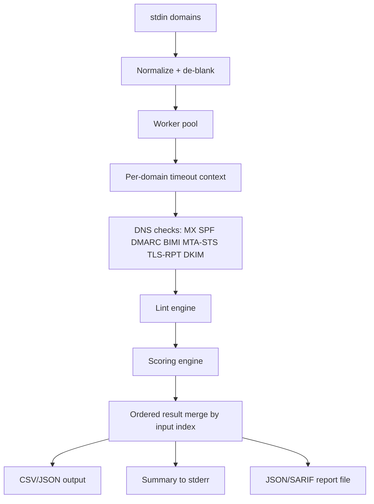

# Email Checker Tool

[](https://github.com/pouyasadri/email-checker-tool/actions/workflows/ci.yml)
[](https://github.com/pouyasadri/email-checker-tool/pkgs/container/email-checker-tool)

`email-checker` is a stdlib-first Go CLI for auditing domain email DNS posture at scale. It is designed for pipelines and batch processing, with deterministic output ordering, concurrent workers, and machine-readable reporting.

## What It Checks

- Core mail DNS: MX, SPF, DMARC
- Extended posture: DKIM selectors, BIMI, MTA-STS, TLS-RPT
- Policy quality: SPF/DMARC lint rules with severity and remediation hints
- Security score: weighted score with per-category breakdown

## Runtime Flow



## Requirements

- Go `1.26+`

## Project Layout

```text
cmd/email-checker/main.go         # CLI flags, orchestration
internal/input/reader.go          # input parsing + normalization
internal/checker/                 # DNS resolver, worker pool, checks, scoring
internal/lint/lint.go             # SPF/DMARC and ecosystem lint rules
internal/output/writer.go         # CSV/JSON stream writers
internal/report/report.go         # summary + JSON/SARIF report generation
.github/workflows/ci.yml          # CI + GHCR image publish
```

## Build

```bash
go build -o email-checker ./cmd/email-checker
```

## Quick Start

```bash
printf "google.com\nexample.com\n" | ./email-checker
```

## Flags

- `-format csv|json` output format (default: `csv`)
- `-workers int` number of workers (default: CPU count)
- `-timeout duration` per-domain timeout (default: `3s`)
- `-resolver host:port` custom DNS resolver (example: `1.1.1.1:53`)
- `-resolver-proto udp|tcp` DNS transport (default: `udp`)
- `-check-dkim` enable DKIM selector checks
- `-dkim-selectors` comma-separated selectors (default: common selectors)
- `-lint` enable lint findings
- `-score` enable score computation
- `-summary` emit aggregate summary to stderr
- `-summary-format text|json` summary format (default: `text`)
- `-failures-only` emit only failed domains
- `-report-file <path>` write full report to file
- `-report-format json|sarif` report format (default: `json`)

## Examples

Run a deeper scan and export JSON report:

```bash
printf "google.com\nexample.com\n" | ./email-checker \
  -format json \
  -workers 8 \
  -timeout 4s \
  -check-dkim \
  -dkim-selectors "default,selector1,google" \
  -lint \
  -score \
  -summary \
  -summary-format json \
  -report-file report.json \
  -report-format json
```

Use custom resolver and export SARIF:

```bash
printf "example.com\n" | ./email-checker \
  -resolver 1.1.1.1:53 \
  -resolver-proto udp \
  -lint \
  -report-file report.sarif \
  -report-format sarif
```

## Output

CSV header (default):

```csv
domain,hasMX,hasSPF,spfRecord,hasDMARC,dmarcRecord,hasBIMI,bimiRecord,hasMTASTS,mtaSTSRecord,hasTLSRPT,tlsRPTRecord,scoreTotal
```

JSON stream mode (`-format json`) emits one JSON object per domain.

## Lint Coverage (Current)

- SPF: missing, multiple records, `+all`, `~all`, no terminal `all`, `ptr` usage
- DMARC: missing, missing `p=`, `p=none`, missing `rua`, missing `ruf`, low `pct`
- Ecosystem: missing DKIM, BIMI, MTA-STS, TLS-RPT

## CI/CD

GitHub Actions workflow in `.github/workflows/ci.yml` runs:

- format check (`gofmt -l .`)
- `go vet ./...`
- `go test ./...`
- `go test -race ./...`
- `go build ./...`
- Docker image publish to `ghcr.io/<owner>/email-checker-tool` (on `main/master` pushes and tags)

## Local Development

```bash
go test ./...
go test -race ./...
go build ./...
```

## Notes

- Output order always follows input order, even with concurrent workers.
- Timeout is applied per entire domain check (not per individual lookup).
- Partial lookup failures still produce rows with available fields.
- Golden fixtures validate JSON and SARIF report stability.

## Next Enhancements

- BIMI content validation (`l=`/`a=` quality checks)
- HTTPS fetch validation for MTA-STS policy files
- TLS-RPT `rua` URI validation and stronger diagnostics
- Scoring profiles (`strict`, `balanced`, `relaxed`)
